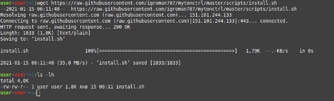
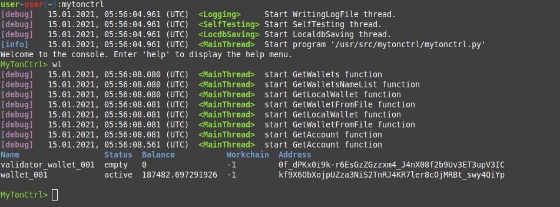
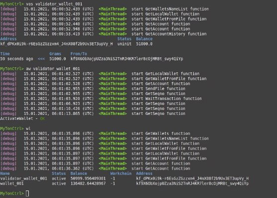
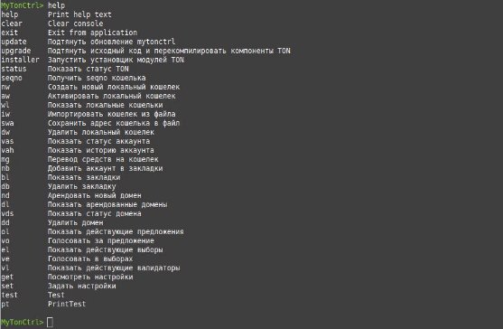
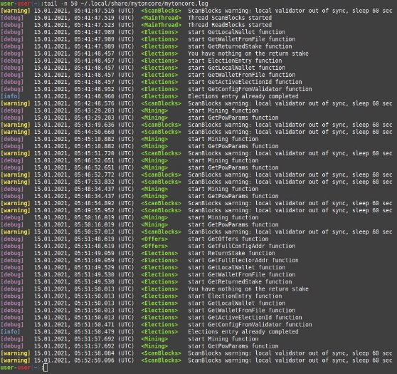
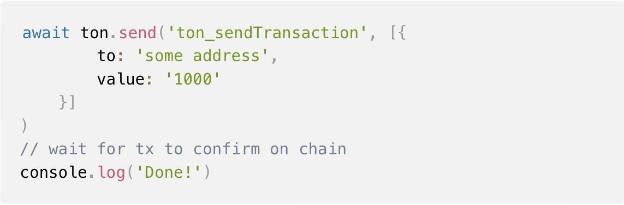
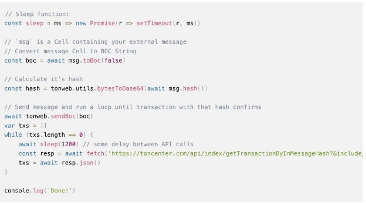

1) **MyTonCtrl**이 란 무 엇 입 니 까**?**

MyTonCtrl은 fift, lite-client 및 validator-engine-console에 대 한 편 리 한 래 퍼 역 할 을 하 는 콘 솔 애 플 리 케 이 션 입 니 다 . 이 는 Linux 운 영 체 제 에 서 지 갑 , 도 메 인 및 유 효 성 검 사 기 관 리 작 업 을 간 소 화 하 기 위 해 특 별 히 개 발 되 었 습 니 다 .

![ref1]

기 능 성

TON 네 트 워 크 상 태 표 시

로 컬 지 갑 관 리

- 로 컬 지 갑 생 성
- 로 컬 지 갑 활 성 화
- 지 역 지 갑 표 시
- 파 일 (.pk)에 서 지 갑 가 져 오 기
- 지 갑 주 소 를 파 일 (.addr)에 저 장
- 로 컬 지 갑 삭 제

계 정 상 태 표 시

- 계 좌 잔 액 표 시
- 계 정 내 역 표 시
- 북 마 크 에 서 계 정 상 태 표 시

지 갑 으 로 자 금 이 체

- 일 정 금 액 이 체
- 전 액 이 체 (모 두 )
- 지 갑 비 활 성 화 로 전 체 금 액 이 체 (alld)
- 북 마 크 에 서 지 갑 으 로 자 금 이 체
- 자 체 삭 제 지 갑 체 인 을 통 해 지 갑 으 로 자 금 이 체

북 마 크 관 리

- 북 마 크 에 계 정 추 가
- 북 마 크 표 시
- 북 마 크 삭 제

제 안 관 리

- 쿠 폰 표 시
- 제 안 에 투 표 하 세 요
- 이 전 에 투 표 된 제 안 에 대 한 자 동 투 표

도 메 인 관 리

- 새 도 메 인 임 대
- 임 대 한 도 메 인 표 시
- 도 메 인 상 태 표 시
- 도 메 인 삭 제
- 자 동 도 메 인 갱 신

유 효 성 검 사 기 제 어

- 검 증 인 선 출 에 참 여
- 베 팅 반 환 + 보 상
- 비 정 상 종 료 시 자 동 시 작 유 효 성 검 사 기 (systemd)
- https://toncenter.com으 로 검 증 인 통 계 보 내 기

테 스 트 된 운 영 체 제 목 록

|운 영 체 제|상 태|
| - | - |
|우 분 투 **16.04 LTS (Xenial Xerus)**|오 류 **: TON** 컴 파 일 오 류|
|우 분 투 **18.04 LTS(**바 이 오 닉 비 버 **)**|**OK**|
|우 분 투 **20.04 LTS(**포 칼 포 사 **)**|**OK**|
|우 분 투 **22.04 LTS(**제 미|**OK**|

|젤 리 피 쉬 **)**||
| - | :- |
|데 비 안 **8**|오 류 **: libgsl-dev** 패 키 지 를 찾 을 수 없 습 니 다 **.**|
|데 비 안 **9**|오 류 **: TON** 컴 파 일 오 류|
|데 비 안 **10**|**OK**|

설 치

설 치 스 크 립 트 개 요

- toninstaller.sh: TON 및 mytonctrl 소 스 를 /usr/src/ton 및 /usr/src/mytonctrl 폴 더 에

복 제 하 고 소 스 에 서 프 로 그 램 을 컴 파 일 하 여 /usr/bin/에 씁 니 다 .

- mytoninstaller.py: 유 효 성 검 사 기 와 mytonctrl을 구 성 합 니 다 . 유 효 성 검 사 기 연 결 키 를 생 성 합 니 다 .

설 치 모 드

설 치 모 드 에 는 라 이 트 와 전 체 의 두 가 지 가 있 습 니 다 . 둘 다 TON 구 성 요 소 를 컴 파 일 하 고 설 치 합 니 다 . 그 러 나 라 이 트 버 전 은 노 드 /검 증 기 를 구 성 하 거 나 실 행 하 지 않 습 니 다 .

우 분 투 설 치

- 원 하 는 설 치 모 드 에 서 install.sh 스 크 립 트 를 다 운 로 드 하 고 실 행 합 니 다 . 설 치 하 는 동 안

스 크 립 트 는 수 퍼 유 저 비 밀 번 호 를 묻 는 메 시 지 를 여 러 번 표 시 합 니 다 . wget <https://raw.githubusercontent.com/ton-blockchain/mytonctrl/master/scripts/install.sh> sudo bash install.sh -m <mode>

- 완 료 . 이 제 mytonctrl 콘 솔 을 실 행 해 볼 수 있 습 니 다 . mytonctrl

데 비 안 설 치

- 원 하 는 설 치 모 드 에 서 install.sh 스 크 립 트 를 다 운 로 드 하 고 실 행 합 니 다 . 설 치 하 는 동 안

스 크 립 트 는 수 퍼 유 저 비 밀 번 호 를 묻 는 메 시 지 를 여 러 번 표 시 합 니 다 . wget <https://raw.githubusercontent.com/ton-blockchain/mytonctrl/master/scripts/install.sh> su root -c 'bash install.sh -m <mode>'

- 완 료 . 이 제 mytonctrl 콘 솔 을 실 행 해 볼 수 있 습 니 다 . mytonctrl

**MyTonCtrl** 문 서

이 저 장 소 에 는 언 어 별 로 분 류 된 다 음 과 같 은 MyTonCtrl 기 술 문 서 가 포 함 되 어 있 습 니 다 . 아 래 링 크 를 클 릭 하 시 면 관 심 있 는 문 서 로 이 동 하 실 수 있 습 니 다 .

<table><tr><th colspan="1"></th><th colspan="1" valign="top">자 주 하 는 질 문</th><th colspan="1" valign="top">
지 갑

가 져 오 기
</th><th colspan="1" valign="top">우 분 투 매 뉴 얼</th></tr>
<tr><td colspan="1" rowspan="7" valign="top">영 어 (EN)</td><td colspan="1" valign="bottom">[https://github.](https://github.com/ton-blockchain/mytonctrl/blob/master/docs/en/FAQ.md)</td><td colspan="1" valign="bottom">[https://github.](https://github.com/ton-blockchain/mytonctrl/blob/master/docs/en/import-wallets.md)</td><td colspan="1" valign="bottom">[https://github](https://github.com/ton-blockchain/mytonctrl/blob/master/docs/en/manual-ubuntu.md)</td></tr>
<tr><td colspan="1" valign="top">[com/ton-bloc](https://github.com/ton-blockchain/mytonctrl/blob/master/docs/en/FAQ.md)</td><td colspan="1" valign="top">[com/ton-bloc](https://github.com/ton-blockchain/mytonctrl/blob/master/docs/en/import-wallets.md)</td><td colspan="1" valign="top">[.com/ton-blo](https://github.com/ton-blockchain/mytonctrl/blob/master/docs/en/manual-ubuntu.md)</td></tr>
<tr><td colspan="1" valign="top">[kchain/myton](https://github.com/ton-blockchain/mytonctrl/blob/master/docs/en/FAQ.md)</td><td colspan="1" valign="top">[kchain/myton](https://github.com/ton-blockchain/mytonctrl/blob/master/docs/en/import-wallets.md)</td><td colspan="1" valign="top">[ckchain/myto](https://github.com/ton-blockchain/mytonctrl/blob/master/docs/en/manual-ubuntu.md)</td></tr>
<tr><td colspan="1" valign="top">[ctrl/blob/mast](https://github.com/ton-blockchain/mytonctrl/blob/master/docs/en/FAQ.md)</td><td colspan="1" valign="top">[ctrl/blob/mast](https://github.com/ton-blockchain/mytonctrl/blob/master/docs/en/import-wallets.md)</td><td colspan="1" valign="top">[nctrl/blob/ma](https://github.com/ton-blockchain/mytonctrl/blob/master/docs/en/manual-ubuntu.md)</td></tr>
<tr><td colspan="1" valign="top">[er/docs/en/F](https://github.com/ton-blockchain/mytonctrl/blob/master/docs/en/FAQ.md)</td><td colspan="1" valign="top">[er/docs/en/im](https://github.com/ton-blockchain/mytonctrl/blob/master/docs/en/import-wallets.md)</td><td colspan="1" valign="top">[ster/docs/en/](https://github.com/ton-blockchain/mytonctrl/blob/master/docs/en/manual-ubuntu.md)</td></tr>
<tr><td colspan="1" valign="top">[AQ.md](https://github.com/ton-blockchain/mytonctrl/blob/master/docs/en/FAQ.md)</td><td colspan="1" valign="top">[port-wallets.](https://github.com/ton-blockchain/mytonctrl/blob/master/docs/en/import-wallets.md)</td><td colspan="1" valign="top">[manual-ubun](https://github.com/ton-blockchain/mytonctrl/blob/master/docs/en/manual-ubuntu.md)</td></tr>
<tr><td colspan="1"></td><td colspan="1" valign="top">[md](https://github.com/ton-blockchain/mytonctrl/blob/master/docs/en/import-wallets.md)</td><td colspan="1" valign="top">[tu.md](https://github.com/ton-blockchain/mytonctrl/blob/master/docs/en/manual-ubuntu.md)</td></tr>
<tr><td colspan="1" rowspan="7" valign="top">러 시 아 어 (RU )</td><td colspan="1" valign="bottom">[https://github.](https://github.com/ton-blockchain/mytonctrl/blob/master/docs/ru/FAQ.md)</td><td colspan="1" valign="bottom">[https://github.](https://github.com/ton-blockchain/mytonctrl/blob/master/docs/ru/import-wallets.md)</td><td colspan="1" valign="bottom">[https://github](https://github.com/ton-blockchain/mytonctrl/blob/master/docs/ru/manual-ubuntu.md)</td></tr>
<tr><td colspan="1" valign="top">[com/ton-bloc](https://github.com/ton-blockchain/mytonctrl/blob/master/docs/ru/FAQ.md)</td><td colspan="1" valign="top">[com/ton-bloc](https://github.com/ton-blockchain/mytonctrl/blob/master/docs/ru/import-wallets.md)</td><td colspan="1" valign="top">[.com/ton-blo](https://github.com/ton-blockchain/mytonctrl/blob/master/docs/ru/manual-ubuntu.md)</td></tr>
<tr><td colspan="1" valign="top">[kchain/myton](https://github.com/ton-blockchain/mytonctrl/blob/master/docs/ru/FAQ.md)</td><td colspan="1" valign="top">[kchain/myton](https://github.com/ton-blockchain/mytonctrl/blob/master/docs/ru/import-wallets.md)</td><td colspan="1" valign="top">[ckchain/myto](https://github.com/ton-blockchain/mytonctrl/blob/master/docs/ru/manual-ubuntu.md)</td></tr>
<tr><td colspan="1" valign="top">[ctrl/blob/mast](https://github.com/ton-blockchain/mytonctrl/blob/master/docs/ru/FAQ.md)</td><td colspan="1" valign="top">[ctrl/blob/mast](https://github.com/ton-blockchain/mytonctrl/blob/master/docs/ru/import-wallets.md)</td><td colspan="1" valign="top">[nctrl/blob/ma](https://github.com/ton-blockchain/mytonctrl/blob/master/docs/ru/manual-ubuntu.md)</td></tr>
<tr><td colspan="1" valign="top">[er/docs/ru/FA](https://github.com/ton-blockchain/mytonctrl/blob/master/docs/ru/FAQ.md)</td><td colspan="1" valign="top">[er/docs/ru/im](https://github.com/ton-blockchain/mytonctrl/blob/master/docs/ru/import-wallets.md)</td><td colspan="1" valign="top">[ster/docs/ru/](https://github.com/ton-blockchain/mytonctrl/blob/master/docs/ru/manual-ubuntu.md)</td></tr>
<tr><td colspan="1" rowspan="2" valign="top">[Q.md](https://github.com/ton-blockchain/mytonctrl/blob/master/docs/ru/FAQ.md)</td><td colspan="1" valign="top">[port-wallets.](https://github.com/ton-blockchain/mytonctrl/blob/master/docs/ru/import-wallets.md)</td><td colspan="1" valign="top">[manual-ubun](https://github.com/ton-blockchain/mytonctrl/blob/master/docs/ru/manual-ubuntu.md)</td></tr>
<tr><td colspan="1" valign="top">[md](https://github.com/ton-blockchain/mytonctrl/blob/master/docs/ru/import-wallets.md)</td><td colspan="1" valign="top">[tu.md](https://github.com/ton-blockchain/mytonctrl/blob/master/docs/ru/manual-ubuntu.md)</td></tr>
<tr><td colspan="1" rowspan="8" valign="top">중 국 어 번 체</td><td colspan="1" valign="bottom">[https://github.](https://github.com/ton-blockchain/mytonctrl/blob/master/docs/zh_TW/FAQ.md)</td><td colspan="1" valign="bottom">[https://github.](https://github.com/ton-blockchain/mytonctrl/blob/master/docs/zh_TW/import-wallets.md)</td><td colspan="1" valign="bottom">[https://github](https://github.com/ton-blockchain/mytonctrl/blob/master/docs/zh_TW/manual-ubuntu.md)</td></tr>
<tr><td colspan="1" valign="top">[com/ton-bloc](https://github.com/ton-blockchain/mytonctrl/blob/master/docs/zh_TW/FAQ.md)</td><td colspan="1" valign="top">[com/ton-bloc](https://github.com/ton-blockchain/mytonctrl/blob/master/docs/zh_TW/import-wallets.md)</td><td colspan="1" valign="top">[.com/ton-blo](https://github.com/ton-blockchain/mytonctrl/blob/master/docs/zh_TW/manual-ubuntu.md)</td></tr>
<tr><td colspan="1" valign="top">[kchain/myton](https://github.com/ton-blockchain/mytonctrl/blob/master/docs/zh_TW/FAQ.md)</td><td colspan="1" valign="top">[kchain/myton](https://github.com/ton-blockchain/mytonctrl/blob/master/docs/zh_TW/import-wallets.md)</td><td colspan="1" valign="top">[ckchain/myto](https://github.com/ton-blockchain/mytonctrl/blob/master/docs/zh_TW/manual-ubuntu.md)</td></tr>
<tr><td colspan="1" valign="top">[ctrl/blob/mast](https://github.com/ton-blockchain/mytonctrl/blob/master/docs/zh_TW/FAQ.md)</td><td colspan="1" valign="top">[ctrl/blob/mast](https://github.com/ton-blockchain/mytonctrl/blob/master/docs/zh_TW/import-wallets.md)</td><td colspan="1" valign="top">[nctrl/blob/ma](https://github.com/ton-blockchain/mytonctrl/blob/master/docs/zh_TW/manual-ubuntu.md)</td></tr>
<tr><td colspan="1" valign="top">[er/docs/zh_T](https://github.com/ton-blockchain/mytonctrl/blob/master/docs/zh_TW/FAQ.md)</td><td colspan="1" valign="top">[er/docs/zh_T](https://github.com/ton-blockchain/mytonctrl/blob/master/docs/zh_TW/import-wallets.md)</td><td colspan="1" valign="top">[ster/docs/zh](https://github.com/ton-blockchain/mytonctrl/blob/master/docs/zh_TW/manual-ubuntu.md)</td></tr>
<tr><td colspan="1" valign="top">[W/FAQ.md](https://github.com/ton-blockchain/mytonctrl/blob/master/docs/zh_TW/FAQ.md)</td><td colspan="1" valign="top">[W/import-wal](https://github.com/ton-blockchain/mytonctrl/blob/master/docs/zh_TW/import-wallets.md)</td><td colspan="1" valign="top">[_TW/manual](https://github.com/ton-blockchain/mytonctrl/blob/master/docs/zh_TW/manual-ubuntu.md)</td></tr>
<tr><td colspan="1" rowspan="2"></td><td colspan="1" valign="top">[lets.md](https://github.com/ton-blockchain/mytonctrl/blob/master/docs/zh_TW/import-wallets.md)</td><td colspan="1" valign="top">[-ubuntu.md](https://github.com/ton-blockchain/mytonctrl/blob/master/docs/zh_TW/manual-ubuntu.md)</td></tr>
<tr><td colspan="1"></td><td colspan="1"></td></tr>
</table>

원 격 측 정

기 본 적 으 로 mytonctrl은 유 효 성 검 사 기 통 계 를 <https://toncenter.com> 서 버 로 보 냅 니 다 . 네 트 워 크 이 상 징 후 를 파 악 하 고 , 개 발 자 에 게 신 속 한 피 드 백 을 제 공 하 는 것 이 필 요 합 니 다 . 설 치 중 에 원 격 측 정 을 비 활 성 화 하 려 면 -t 플 래 그 를 사 용 하 십 시 오 .

sudo bash install.sh -m <mode> -t

설 치 후 원 격 측 정 을 비 활 성 화 하 려 면 다 음 을 수 행 합 니 다 .

MyTonCtrl> set sendTelemetry false

**MyTonCtrl** 설 치 프 로 그 램 모 드 웹 관 리 패 널

브 라 우 저 를 통 해 노 드 /검 증 기 를 제 어 하 려 면 추 가 모 듈 을 설 치 해 야 합 니 다 : mytonctrl -> 설 치 프 로 그 램 -> JR 활 성 화

다 음 으 로 , 연 결 을 위 한 비 밀 번 호 를 생 성 해 야 합 니 다 : mytonctrl -> installer -> setwebpass

준 비 가 된 . 이 제 <https://tonadmin.org> 사 이 트 로 이 동 하 여 자 격 증 명 으 로 로 그 인 할 수 있 습 니 다 . 자 식 : <https://github.com/igroman787/mtc-jsonrpc>

**toncenter**의 로 컬 복 사 본

서 버 에 로 컬 <https://toncenter.com> 복 사 본 을 설 정 하 려 면 추 가 모 듈 을 설 치 하 십 시 오 : mytonctrl ->installer -> PT 활 성 화

준 비 가 된 . toncenter의 로 컬 복 사 본 은 http://<server-ip-address>:8000 git: <https://github.com/igroman787/pytonv3> 에 서 사 용 할 수 있 습 니 다 .

유 용 한 링 크

- <https://docs.ton.org/>
2) **mytonctrl(v0.2, OS Ubuntu)**을 사 용 하 여 유 효 성 검 사 기 가 되 는 방 법

mytonctrl을 사 용 하 여 유 효 성 검 사 기 가 되 는 단 계 는 다 음 과 같 습 니 다 . 이 예 는 Ubuntu 운 영 체 제 에 적 용 됩 니 다 .

1. **mytonctrl**을 설 치 합 니 다 **:**
- 설 치 스 크 립 트 를 다 운 로 드 합 니 다 . 루 트 가 아 닌 로 컬 사 용 자 계 정 으 로 도 구 를 설 치 하 는 것 이 좋 습 니 다 . 이 예 에 서 는 로 컬 사 용 자 계 정 이 사 용 됩 니 다 . wget

<https://raw.githubusercontent.com/ton-blockchain/mytonctrl/master/scripts/install.sh>

- 관 리 자 로 설 치 스 크 립 트 를 실 행 합 니 다 . wget <https://raw.githubusercontent.com/ton-blockchain/mytonctrl/master/scripts/install.sh>
2. 운 용 성 테 스 트 실 시 **:**
- 1단 계 에 서 설 치 에 사 용 한 로 컬 사 용 자 계 정 에 서 mytonctrl을 실 행 합 니 다 . mytonctrl
- mytonctrl 상 태 , 특 히 다 음 을 확 인 하 십 시 오 .
- mytoncore 상 태 : 녹 색 이 어 야 합 니 다 .
- 로 컬 검 증 인 상 태 : 또 한 녹 색 이 어 야 합 니 다 .
- 로 컬 검 증 인 이 동 기 화 되 지 않 음 : 처 음 에 는 큰 숫 자 가 표 시 됩 니 다 . 새 로 생 성 된 검 증 인 이 다 른 검 증 인 과 연 결 되 면 그 수 는 약 250,000개 가 됩 니 다 . 동 기 화 가 진 행 됨 에 따 라 이

숫 자 는 감 소 합 니 다 . 20 미 만 으 로 떨 어 지 면 유 효 성 검 사 기 가 동 기 화 됩 니 다 .

![ref1]

3. 사 용 가 능 한 지 갑 목 록 보 기

사 용 가 능 한 지 갑 목 록 을 확 인 하 세 요 . 예 를 들 어 mytonctrl을 설 치 하 는 동 안 validator\_wallet\_001 지 갑 이 생 성 됩 니 다 .

4. 필 요 한 만 큼 의 코 인 을 지 갑 으 로 보 내 고 활 성 화 하 세 요 **.**

한 번 의 선 거 라 운 드 에 참 여 하 는 데 필 요 한 최 소 코 인 금 액 을 확 인 하 려 면 tonmon.xyz > Participant stakes.

- vas 명 령 을 사 용 하 여 전 송 기 록 을 표 시 합 니 다 .
- aw 명 령 을 사 용 하 여 지 갑 을 활 성 화 합 니 다 .

5. 이 제 유 효 성 검 사 기 가 준 비 되 었 습 니 다

mytoncore는 자 동 으 로 선 거 에 참 여 합 니 다 . 지 갑 잔 액 을 두 부 분 으 로 나 누 어 선 거 에 참 여 하 기 위 한 지 분 으 로 사 용 합 니 다 . 스 테 이 크 크 기 를 수 동 으 로 설 정 할 수 도 있 습 니 다 .

스 테 이 크 50000 설 정 - 스 테 이 크 크 기 를 50,000코 인 으 로 설 정 합 니 다 . 베 팅 이 수 락 되 고 우 리 노 드 가 검 증 자 가 되 면 베 팅 은 두 번 째 선 거 에 서 만 철 회 될 수 있 습 니 다 (유 권 자 의 규 칙 에 따 라 ).

언 제 든 지 도 움 을 요 청 할 수 도 있 습 니 다 .

mytoncrl 로 그 를 확 인 하 려 면 다 음 을 엽 니 다 . ~/.local/share/mytoncore/mytoncore.log 로 컬 사 용 자 의 경 우 또 는 /usr/local/bin/mytoncore/mytoncore.log 루 트 용 .

3) 추 천 자 풀

후 보 풀 모 드 에 서 유 효 성 검 사 기 실 행

1. 유 효 성 검 사 기 용 하 드 웨 어 를 설 정 하 세 요 . vCPU 8개 , 64GB 메 모 리 , 1TB SSD, 고 정 IP 주 소 , 1Gb/s 인 터 넷 속 도 가 필 요 합 니 다 . 네 트 워 크 안 정 성 을 유 지 하 려 면 검 증 인 노 드 를 단 일 데 이 터 센 터 에 집 중 시 키 기 보 다 는 전 세 계 다 양 한 지 리 적 위 치 에 분 산 시 키 는 것 이 좋 습 니 다 . 당 신 이 사 용 할 수 있 는 <https://status.toncenter.com> 다 양 한 위 치 의 부 하 를

평 가 합 니 다 . 지 도 는 유 럽 , 특 히 핀 란 드 , 독 일 , 파 리 에 서 데 이 터 센 터 활 용 도 가 높 다 는 것 을 나 타 냅 니 다 . 따 라 서 Hetzner, OVH와 같 은 공 급 자 를 사 용 하 는 것 은 권 장 되 지

않 습 니 다 . (하 드 웨 어 가 위 의 사 양 과 일 치 하 거 나 이 를 초 과 하 는 지 확 인 하 세 요 . 부 족 한

하 드 웨 어 에 서 유 효 성 검 사 기 를 실 행 하 면 네 트 워 크 에 부 정 적 인 영 향 을 미 치 고 처 벌 을

받 을 수 있 습 니 다 . 2021년 5월 부 터 Hener는 서 버 에 서 의 채 굴 을 금 지 했 으 며 ,이 러 한

금 지 에 는 PW 및 PS 알 고 리 즘 이 모 두 포 함 됩 니 다 . 일 반 노 드 를 설 치 하 는 것 조 차 서 비 스 약 관 을 위 반 하 는 것 으 로 간 주 될 수 있 습 니 다 . 권 장 공 급 자 에 는 Amo,DigitaOcea, Linod,AlibabClou,Latitud가 있 습 니 다 ).

2. 가 이 드 에 설 명 된 대 로 mytonctrl을 설 치 하 고 동 기 화 합 니 다 <https://github.com/ton-blockchain/mytonctrl/blob/master/docs/en/manual-ubuntu.md> — 1, 2, 3단 계 만 따 르 십 시 오 . 이 것 도 참 고 하 시 면 됩 니 다 <https://ton.org/docs/#/nodes/run-node> 추 가 도 움 이 필 요 한 경 우 .
2. wl 목 록 에 표 시 된 검 증 인 지 갑 주 소 로 1TON을 전 송 합 니 다 .
2. aw 명 령 을 사 용 하 여 유 효 성 검 사 기 지 갑 을 활 성 화 하 세 요 .
2. 두 개 의 풀 을 만 듭 니 다 (짝 수 및 홀 수 검 증 라 운 드 용 ).

new\_pool p1 0 1 1000 300000 new\_pool p2 0 1 1001 300000

어 디 :

- p1은 풀 이 름 입 니 다 .
- 0%는 검 증 인 의 보 상 지 분 입 니 다 (예 : 40%에 40을 사 용 ).
- 1은 풀 의 최 대 추 천 자 수 입 니 다 (<= 40이 어 야 함 ).
- 1000 TON은 최 소 검 증 인 스 테 이 크 입 니 다 (1K TON 이 상 이 어 야 함 ).
- 300000 TON은 최 소 지 정 자 지 분 입 니 다 (10K TON 이 상 이 어 야 함 ). ((!) 풀 구 성 은 동 일 할 필 요 가 없 으 며 ,한 풀 의 최 소 지 분 에 1을 추 가 하 여 다 르 게 만 들 수 있 습 니 다 . (!) <https://tonmon.xyz/> 를 사 용 하 여 현 재 최 소 검 증 인 지 분 을 결 정 하 세 요 ).
6. 풀 주 소 를 표 시 하 려 면 pools\_list를 입 력 하 세 요 .

pools\_list

Name Status Balance Address

p1 empty 0 0f98YhXA9wnr0d5XRXT-I2yH54nyQzn0tuAYC4FunT780qIT p2 empty 0 0f9qtmnzs2-PumMisKDmv6KNjNfOMDQG70mQdp-BcAhnV5jL

7. 각 풀 에 1TON을 보 내 고 풀 을 활 성 화 합 니 다 .

mg validator\_wallet\_001 0f98YhXA9wnr0d5XRXT-I2yH54nyQzn0tuAYC4FunT780qIT 1 mg validator\_wallet\_001 0f9qtmnzs2-PumMisKDmv6KNjNfOMDQG70mQdp-BcAhnV5jL 1 activate\_pool p1

activate\_pool p2

8. 풀 을 표 시 하 려 면 pools\_list를 입 력 하 세 요 .

pools\_list

Name Status Balance Address

p1 active 0.731199733 kf98YhXA9wnr0d5XRXT-I2yH54nyQzn0tuAYC4FunT780v\_W p2 active 0.731199806 kf9qtmnzs2-PumMisKDmv6KNjNfOMDQG70mQdp-BcAhnV8UO

9. <https://tonscan.org/nominator/><address\_of\_pool>". 링 크 를 통 해 각 풀 을 열 고 풀 구 성 을

확 인 하 세 요 .

10. 각 풀 에 검 증 인 입 금 을 진 행 하 세 요 .

deposit\_to\_pool validator\_wallet\_001 <address\_of\_pool\_1> 1005 deposit\_to\_pool validator\_wallet\_001 <address\_of\_pool\_2> 1005

이 명 령 에 서 1005 TON은 입 금 액 입 니 다 . 보 증 금 처 리 를 위 해 풀 에 서 1TON을 차 감 합 니 다 .

11. 각 풀 에 지 명 자 입 금 을 진 행 하 세 요 :
- 풀 링 크 (9단 계 )를 방 문 하 여 ADD STAKE를 클 릭 하 세 요 . 다 음 명 령 을 사 용 하 여 mytonctrl을 사 용 하 여 입 금 할 수 도 있 습 니 다 .

mg nominator\_wallet\_001 <address\_of\_pool\_1> 300001 -C d mg nominator\_wallet\_001 <address\_of\_pool\_2> 300001 -C d

- (!) 노 미 네 이 터 지 갑 은 베 이 스 체 인 (워 크 체 인 0)에 서 초 기 화 되 어 야 합 니 다 .
  - (!) 검 증 인 지 갑 과 노 미 네 이 터 지 갑 은 별 도 로 보 관 해 야 한 다 는 점 꼭 기 억 해 주 세 요 !모 든 시 스 템 거 래 의 처 리 를 보 장 하 기 위 해 검 증 자 지 갑 은 검 증 자 노 드 와 함 께 서 버 에 저 장 되 어 야 합 니 다 . 한 편 ,노 미 네 이 터 지 갑 은 콜 드 암 호 화 폐 지 갑 에 보 관 되 어 야 합 니 다 .
    - 지 명 자 예 치 금 을 인 출 하 려 면 w라 는 코 멘 트 가 포 함 된 트 랜 잭 션 을 풀 주 소 로

보 냅 니 다 (트 랜 잭 션 을 처 리 하 려 면 1TON을 첨 부 하 세 요 ). mytonctr을 사 용 하 여 이 작 업 을 수 행 할 수 도 있 습 니 다 .

12. 풀 모 드 활 성 화 :

set usePool true set stake null

13. 귀 하 의 풀 에 입 금 할 후 보 를 초 대 하 십 시 오 . 검 증 참 여 는 자 동 으 로 시 작 됩 니 다 .

 (!) 검 증 인 지 갑 에 운 영 비 로 최 소 200TON/월 이 있 어 야 합 니 다 .

풀 구 성

자 신 에 게 빌 려 주 려 는 경 우 new\_pool p1 0 1 1000 300000(최 대 1명 의 추 천 자 , 0% 검 증 인 지 분 )을 사 용 하 세 요 .

수 많 은 추 천 자 를 위 한 풀 을 생 성 하 는 경 우 다 음 과 같 은 것 을 사 용 할 수 있 습 니 다 : new\_pool p1 40 40 10000 10000 (최 대 40명 의 추 천 자 , 40% 검 증 인 지 분 , 최 소 참 가 자 스 테 이 크 10K TON).

일 반 검 증 인 을 후 보 풀 모 드 로 전 환

- 선 거 참 여 를 중 단 하 려 면 set 스 테 이 크 0을 입 력 하 세 요 .
- 유 권 자 로 부 터 두 지 분 이 모 두 반 환 될 때 까 지 기 다 리 십 시 오 .
- 4단 계 부 터 "노 미 네 이 터 풀 모 드 에 서 검 증 인 실 행 " 단 계 를 진 행 하 세 요 .
4) 지 갑 가 져 오 기

MyTonCtrl은 wallet-v1, wallet-v3, lockup-wallet 등 다 양 한 유 형 의 지 갑 형 계 약 을 지 원 합 니 다 . 종 종 이 는 이 러 한 계 약 과 상 호 작 용 하 는 간 단 한 방 법 을 제 공 합 니 다 .

개 인 키 를 사 용 하 여 가 져 오 기

개 인 키 에 접 근 할 수 있 다 면 쉽 게 지 갑 을 가 져 올 수 있 습 니 다 . 콘 솔 에 다 음 명 령 을 입 력 합 니 다 . iw <wallet-addr> <wallet-secret-key>

여 기 서 <wallet-secret-key>는 base64 형 식 의 개 인 키 입 니 다 .

니 모 닉 문 구 를 사 용 하 여 가 져 오 기

니 모 닉 문 구 (... 동 안 문 신 과 같 은 24개 단 어 의 시 퀀 스 )가 있 는 경 우 다 음 단 계 를 따 르 세 요 .

- Node.js를 설 치 합 니 다 .
- mnemonic2key를 복 제 하 고 설 치 합 니 다 . git clone <https://github.com/ton-blockchain/mnemonic2key.git> cd mnemonic2key npm install
- 다 음 명 령 을 실 행 하 여 word1, word2...를 니 모 닉 문 구 로 바 꾸 고 주 소 를 지 갑 계 약 주 소 로 바 꾸 세 요 . node index.js word1 word2 ... word24 [address]
- 스 크 립 트 는 wallet.pk 및 wallet.addr을 생 성 합 니 다 . import\_wallet.pk 및 import\_wallet.addr로 이 름 을 바 꾸 세 요 .
- 두 파 일 을 모 두 ~/.local/share/mytoncore/wallets/ 디 렉 터 리 에 복 사 합 니 다 .
- mytonctrl 콘 솔 을 열 고 wl 명 령 을 사 용 하 여 지 갑 을 나 열 하 십 시 오 .
- 지 갑 을 가 져 왔 고 올 바 른 잔 액 이 표 시 되 는 지 확 인 하 세 요 .
- 이 제 mg 명 령 을 사 용 하 여 자 금 을 보 낼 수 있 습 니 다 . 도 움 말 문 서 를 보 려 면 mg를

입 력 하 세 요 .

명 령 을 실 행 할 때 자 리 표 시 자 (< > 안 의 단 어 )를 실 제 값 으 로 바 꾸 는 것 을 잊 지 마 십 시 오 .

5) 자 주 묻 는 질 문
1) 이 전 블 록 에 따 라 데 이 터 를 쿼 리 하 는 **API** 메 서 드 가 있 나 요 **?** 예 를 들 어 **,** 이 전 블 록 번 호 를 지 정 하 고 지 갑 의 **TON** 잔 액 을 쿼 리 합 니 다 **.**

다 른 예 는 이 전 블 록 에 따 라 **jetton** 계 약 균 형 방 법 과 같 은 **getter**를 실 행 하 는 것 입 니 다 **.** 이 를 위 해 아 카 이 브 노 드 가 필 요 합 니 까 **?**

답 변

- 톤 풀 노 드 ([https://github.com/ton-blockchain/ton/blob/master/validator/validator.h#L95 ](https://github.com/ton-blockchain/ton/blob/master/validator/validator.h#L95))의 기 본 구 성 은 1시 간 동 안 상 태 를 저 장 하 는 것 입 니 다 . 블 록 관 련 데 이 터 는 1주 일 동 안 저 장 됩 니 다 . 이 기 간 이 지 나 면 둘 다 아 카 이 브 디 렉 토 리 로 이 동 됩 니 다 . 아 카 이 브

디 렉 토 리 는 1년 후 에 삭 제 됩 니 다 . 이 구 성 은 변 경 될 수 있 으 며 예 를 들 어 보 관 노 드 는 훨 씬 더 큰 값 으 로 노 드 를 배 포 하 므 로 사 용 자 는 언 제 든 지 기 록 에 서 상 태 를 쿼 리 할 수 있 습 니 다 . 이 전 상 태 (1시 간 이 상 전 )를 쿼 리 하 려 면 아 카 이 브 노 드 를 사 용 해 야 합 니 다 . TON APIv4를 사 용 하 면 jetton 잔 액 을 쿼 리 하 기 위 해 method=get\_wallet\_data와 함 께 사 용 할 수 있 는 GET /block/<seqno>/<address>/run/<method>/<args?>를 쿼 리 할 수

있 습 니 다 . 예 를 들 어 Toncenter에 서 는 이 전 상 태 에 서 메 서 드 를 쿼 리 하 는 것 이

불 가 능 합 니 다 . 그 러 나 archive=true와 함 께 getTransactions를 사 용 하 면 모 든

트 랜 잭 션 을 가 져 오 고 각 상 태 의 정 확 한 금 액 을 계 산 할 수 있 습 니 다 . 비 아 카 이 브 (기 본 ) 노 드 의 트 랜 잭 션 은 1주 일 동 안 저 장 됩 니 다 .

2) **The Open Network** 거 래 에 대 한 가 스 수 수 료 는 어 떻 게 계 산 되 나 요 **?** 답 변
- 첫 째 , 모 든 TON 사 용 자 는 커 미 션 이 여 러 요 인 에 따 라 달 라 진 다 는 점 을 명 심 해 야

합 니 다 . 문 서 에 따 르 면 TON의 커 미 션 은 다 음 공 식 으 로 계 산 됩 니 다 . 거 래 수 수 료 = 저 장 수 수 료 + infwd 수 수 료 + 계 산 수 수 료 + 조 치 수 수 료 + outfwd 수 수 료 저 장 수 수 료 는

블 록 체 인 에 스 마 트 계 약 을 저 장 하 기 위 해 지 불 하 는 금 액 입 니 다 . 실 제 로 스 마 트 계 약 이 블 록 체 인 에 저 장 되 는 매 초 마 다 비 용 을 지 불 하 게 됩 니 다 . TON 지 갑 은 거 래 를 받 거 나

보 낼 때 마 다 임 대 료 를 청 구 하 는 스 마 트 계 약 이 기 도 합 니 다 . infwdfees는 블 록 체 인

외 부 에 서 메 시 지 를 가 져 오 는 데 대 한 요 금 입 니 다 . 메 시 지 를 처 리 하 기 전 에 메 시 지 는

최 종 샤 드 체 인 의 검 증 자 에 게 전 달 되 어 야 합 니 다 . 거 래 를 할 때 마 다 이 를 처 리 할

검 증 자 에 게 전 달 되 어 야 합 니 다 . 예 를 들 어 Tonkeeper와 같 은 지 갑 앱 을 사 용 하 여

수 행 하 는 각 거 래 는 먼 저 검 증 노 드 간 에 전 달 되 어 야 합 니 다 . 계 산 수 수 료 는 가 상

머 신 에 서 코 드 를 실 행 하 기 위 해 지 불 하 는 금 액 입 니 다 . 가 상 머 신 은 전 송 된

메 시 지 로 부 터 입 력 매 개 변 수 를 수 신 하 고 스 마 트 계 약 코 드 를 실 행 합 니 다 . 더 많 은

명 령 이 실 행 될 수 록 더 많 은 커 미 션 이 발 생 합 니 다 . 예 를 들 어 , 지 갑 (스 마 트 계 약 )으 로

거 래 를 보 낼 때 마 다 지 갑 계 약 의 코 드 가 실 행 됩 니 다 .

- actionfees는 스 마 트 계 약 코 드 실 행 후 수 신 된 작 업 목 록 을 처 리 하 는 데 드 는

수 수 료 입 니 다 . 이 프 로 세 스 를 통 해 나 가 는 메 시 지 는 다 른 스 마 트 계 약 이 나

블 록 체 인 에 서 수 행 되 는 기 타 가 시 적 작 업 으 로 전 송 됩 니 다 .

- outfwdfees – 오 프 체 인 서 비 스 (예 : 로 그 ) 및 외 부 블 록 체 인 과 상 호 작 용 하 기 위 해 TON 블 록 체 인 외 부 로 메 시 지 를 보 내 는 데 대 한 요 금 을 나 타 냅 니 다 . 요 금 은 최 종 샤 드 체 인 의 검 증 자 에 게 전 달 됩 니 다 . 구 현 되 지 않 았 기 때 문 에 사 용 되 지 않 습 니 다 .
- 모 든 수 수 료 는 특 정 가 스 량 으 로 지 정 되 고 고 정 되 지 만 가 스 가 격 자 체 는 고 정 되 어 있 지 않 습 니 다 (현 재 1 가 스 단 위 의 가 격 은 1000나 노 톤 입 니 다 ). TON의 다 른 많 은 매 개 변 수 와 마 찬 가 지 로 가 스 요 금 도 구 성 가 능 \*하 며 메 인 넷 에 서 이 루 어 진 특 별 투 표 를 통 해 변 경 될 수 있 습 니 다 . 매 개 변 수 를 변 경 하 려 면 검 증 인 투 표 의 3분 의 2를 얻 어 야 합 니 다 . 언 젠 가

가 스 가 1000배 또 는 그 이 상 증 가 할 수 있 다 는 의 미 입 니 까 ? 기 술 적 으 로 는 그 렇 습 니 다 . 그 러 나 실 제 로 는 그 렇 지 않 습 니 다 . 검 증 인 은 거 래 처 리 에 대 해 소 액 의 수 수 료 를 받 으 며 , 수 수 료 를 높 이 면 거 래 수 가 줄 어 들 어 검 증 프 로 세 스 의 이 점 이 줄 어 듭 니 다 . 그 렇 기

때 문 에 수 수 료 를 올 려 도 소 용 이 없 습 니 다 . TON의 수 수 료 는 거 래 실 행 시 간 , 계 정 상 태 , 메 시 지 내 용 및 크 기 , 블 록 체 인 의 네 트 워 크 설 정 , 그 리 고 거 래 가 전 송 될 때 까 지 계 산 할 수 없 는 많 은 변 수 에 따 라 금 액 이 달 라 지 기 때 문 에 미 리 계 산 하 기 가 어 렵 습 니 다 . 이 것 이 바 로 NFT 마 켓 플 레 이 스 가 만 일 을 대 비 해 추 가 금 액 의 TON을 가 져 갔 다 가 나 중 에

반 환 하 는 이 유 입 니 다 . TON에 서 는 스 마 트 계 약 실 행 과 사 용 된 스 토 리 지 (바 이 트 \*초 )에

대 한 비 용 을 모 두 지 불 한 다 는 점 을 명 심 하 는 것 이 중 요 합 니 다 . 이 는 TON 지 갑 을

소 유 하 기 위 해 임 대 료 를 지 불 해 야 함 을 의 미 합 니 다 (보 통 매 우 작 음 ). 그 러 나 장 기 간 TON 지 갑 을 사 용 하 지 않 은 경 우 평 소 보 다 훨 씬 더 많 은 수 수 료 를 지 불 해 야 합 니 다 . tonmon.xyz에 따 르 면 초 당 평 균 TON 트 랜 잭 션 수 는 현 재 1.4개 이 지 만 , 이 값 이 크 게

증 가 하 면 다 른 블 록 체 인 과 달 리 수 수 료 는 동 일 하 게 유 지 됩 니 다 . TON 공 식 웹 사 이 트 에 따 르 면 , 블 록 체 인 은 샤 딩 지 원 덕 분 에 초 당 수 백 만 건 , 필 요 한 경 우 수 천 만 건 의 거 래 를 수 행 할 수 있 습 니 다 . 오 늘 날 모 든 거 래 비 용 은 약 0.005TON입 니 다 . TON의 가 격 이 50배 상 승 하 더 라 도 거 래 는 다 른 블 록 체 인 보 다 저 렴 하 게 유 지 됩 니 다 . 그 리 고 수 수 료 가

비 싸 졌 다 고 판 단 되 면 검 증 인 이 이 값 을 낮 출 수 있 다 는 점 을 잊 지 마 십 시 오 . 이 질 문 에 대 해 구 독 자 에 게 감 사 드 립 니 다 . 우 리 는 TON의 매 우 포 괄 적 인 측 면 을 배 우 는 데 매 우

관 심 이 있 었 습 니 다 . 우 리 는 봇 을 통 해 모 든 구 독 자 의 질 문 과 피 드 백 을 환 영 합 니 다 .

우 리 는 항 상 TON에 관 한 모 든 사 항 을 더 자 세 히 알 아 보 고 명 확 하 게 설 명 할 수 있 어 서

기 쁩 니 다 .

수 수 료 계 산

보 관 **\_**수 수 료

- Storage\_fees = ceil((account.bits \* bit\_price + account.cells \* cell\_price) \* 기 간 / 2 ^ 16)

**in\_fwd\_fees, out\_fwd\_fees**

- msg\_fwd\_fees = (lump\_price + ceil((bit\_price \* msg.bits + cell\_price \* msg.cells)/2^16))
- ihr\_fwd\_fees = ceil((msg\_fwd\_fees \* ihr\_price\_factor)/2^16)
- // 메 시 지 루 트 셀 의 비 트 는 msg.bits에 포 함 되 지 않 습 니 다 (lump\_price가 해 당 비 용 을

지 불 함 ).

행 동 **\_**수 수 료

- action\_fees = 합 계 (out\_ext\_msg\_fwd\_fee) + 합 계 (int\_msg\_mine\_fee)

구 성 파 일

모 든 수 수 료 는 특 정 가 스 금 액 으 로 지 정 되 며 변 경 될 수 있 습 니 다 . 구 성 파 일 은 현 재 수 수 료

비 용 을 나 타 냅 니 다 . [**https://explorer.toncoin.org/config?workchain=-1&shard=8000000000000000&seqno=221 85244&roothash=165D55B3CFFC4043BFC43F81C1A3F2C41B69B33D6615D46FBFD20362**](https://explorer.toncoin.org/config?workchain=-1&shard=8000000000000000&seqno=22185244&roothash=165D55B3CFFC4043BFC43F81C1A3F2C41B69B33D6615D46FBFD2036256756382&filehash=69C43394D872B02C334B75F59464B2848CD4E23031C03CA7F3B1F98E8A13EE05) [**56756382&filehash=69C43394D872B02C334B75F59464B2848CD4E23031C03CA7F3B1F98 E8A13EE05**](https://explorer.toncoin.org/config?workchain=-1&shard=8000000000000000&seqno=22185244&roothash=165D55B3CFFC4043BFC43F81C1A3F2C41B69B33D6615D46FBFD2036256756382&filehash=69C43394D872B02C334B75F59464B2848CD4E23031C03CA7F3B1F98E8A13EE05)

저 장 **\_**수 수 료 **= [https://explorer.toncoin.org/config?workchain=-1&shard=8000000000000000&seqno=221 85244&roothash=165D55B3CFFC4043BFC43F81C1A3F2C41B69B33D6615D46FBFD20362 56756382&filehash=69C43394D872B02C334B75F59464B2848CD4E23031C03CA7F3B1F98 E8A13EE05#configparam18**](https://explorer.toncoin.org/config?workchain=-1&shard=8000000000000000&seqno=22185244&roothash=165D55B3CFFC4043BFC43F81C1A3F2C41B69B33D6615D46FBFD2036256756382&filehash=69C43394D872B02C334B75F59464B2848CD4E23031C03CA7F3B1F98E8A13EE05#configparam18)**

**in\_fwd\_fees = [https://explorer.toncoin.org/config?workchain=-1&shard=8000000000000000&seqno=221 85244&roothash=165D55B3CFFC4043BFC43F81C1A3F2C41B69B33D6615D46FBFD20362 56756382&filehash=69C43394D872B02C334B75F59464B2848CD4E23031C03CA7F3B1F98 E8A13EE05#configparam24](https://explorer.toncoin.org/config?workchain=-1&shard=8000000000000000&seqno=22185244&roothash=165D55B3CFFC4043BFC43F81C1A3F2C41B69B33D6615D46FBFD2036256756382&filehash=69C43394D872B02C334B75F59464B2848CD4E23031C03CA7F3B1F98E8A13EE05#configparam24) , [https://explorer.toncoin.org/config?workchain=-1&shard=8000000000000000&seqno=221 85244&roothash=165D55B3CFFC4043BFC43F81C1A3F2C41B69B33D6615D46FBFD20362 56756382&filehash=69C43394D872B02C334B75F59464B2848CD4E23031C03CA7F3B1F98 E8A13EE05#configparam25**](https://explorer.toncoin.org/config?workchain=-1&shard=8000000000000000&seqno=22185244&roothash=165D55B3CFFC4043BFC43F81C1A3F2C41B69B33D6615D46FBFD2036256756382&filehash=69C43394D872B02C334B75F59464B2848CD4E23031C03CA7F3B1F98E8A13EE05#configparam25)**

계 산 **\_**수 수 료 **= [https://explorer.toncoin.org/config?workchain=-1&shard=8000000000000000&seqno=221 85244&roothash=165D55B3CFFC4043BFC43F81C1A3F2C41B69B33D6615D46FBFD20362 56756382&filehash=69C43394D872B02C334B75F59464B2848CD4E23031C03CA7F3B1F98 E8A13EE05#configparam20](https://explorer.toncoin.org/config?workchain=-1&shard=8000000000000000&seqno=22185244&roothash=165D55B3CFFC4043BFC43F81C1A3F2C41B69B33D6615D46FBFD2036256756382&filehash=69C43394D872B02C334B75F59464B2848CD4E23031C03CA7F3B1F98E8A13EE05#configparam20) , [https://explorer.toncoin.org/config?workchain=-1&shard=8000000000000000&seqno=221 85244&roothash=165D55B3CFFC4043BFC43F81C1A3F2C41B69B33D6615D46FBFD20362 56756382&filehash=69C43394D872B02C334B75F59464B2848CD4E23031C03CA7F3B1F98 E8A13EE05#configparam21**](https://explorer.toncoin.org/config?workchain=-1&shard=8000000000000000&seqno=22185244&roothash=165D55B3CFFC4043BFC43F81C1A3F2C41B69B33D6615D46FBFD2036256756382&filehash=69C43394D872B02C334B75F59464B2848CD4E23031C03CA7F3B1F98E8A13EE05#configparam21)**

**action\_fees = [https://explorer.toncoin.org/config?workchain=-1&shard=8000000000000000&seqno=221 85244&roothash=165D55B3CFFC4043BFC43F81C1A3F2C41B69B33D6615D46FBFD20362 56756382&filehash=69C43394D872B02C334B75F59464B2848CD4E23031C03CA7F3B1F98 E8A13EE05#configparam24](https://explorer.toncoin.org/config?workchain=-1&shard=8000000000000000&seqno=22185244&roothash=165D55B3CFFC4043BFC43F81C1A3F2C41B69B33D6615D46FBFD2036256756382&filehash=69C43394D872B02C334B75F59464B2848CD4E23031C03CA7F3B1F98E8A13EE05#configparam24) , [https://explorer.toncoin.org/config?workchain=-1&shard=8000000000000000&seqno=221 85244&roothash=165D55B3CFFC4043BFC43F81C1A3F2C41B69B33D6615D46FBFD20362 56756382&filehash=69C43394D872B02C334B75F59464B2848CD4E23031C03CA7F3B1F98 E8A13EE05#configparam25**](https://explorer.toncoin.org/config?workchain=-1&shard=8000000000000000&seqno=22185244&roothash=165D55B3CFFC4043BFC43F81C1A3F2C41B69B33D6615D46FBFD2036256756382&filehash=69C43394D872B02C334B75F59464B2848CD4E23031C03CA7F3B1F98E8A13EE05#configparam25)**

**out\_fwd\_fees = [https://explorer.toncoin.org/config?workchain=-1&shard=8000000000000000&seqno=221 85244&roothash=165D55B3CFFC4043BFC43F81C1A3F2C41B69B33D6615D46FBFD20362 56756382&filehash=69C43394D872B02C334B75F59464B2848CD4E23031C03CA7F3B1F98 E8A13EE05#configparam24](https://explorer.toncoin.org/config?workchain=-1&shard=8000000000000000&seqno=22185244&roothash=165D55B3CFFC4043BFC43F81C1A3F2C41B69B33D6615D46FBFD2036256756382&filehash=69C43394D872B02C334B75F59464B2848CD4E23031C03CA7F3B1F98E8A13EE05#configparam24) ,**

[**https://explorer.toncoin.org/config?workchain=-1&shard=8000000000000000&seqno=221 85244&roothash=165D55B3CFFC4043BFC43F81C1A3F2C41B69B33D6615D46FBFD20362 56756382&filehash=69C43394D872B02C334B75F59464B2848CD4E23031C03CA7F3B1F98 E8A13EE05#configparam25**](https://explorer.toncoin.org/config?workchain=-1&shard=8000000000000000&seqno=22185244&roothash=165D55B3CFFC4043BFC43F81C1A3F2C41B69B33D6615D46FBFD2036256756382&filehash=69C43394D872B02C334B75F59464B2848CD4E23031C03CA7F3B1F98E8A13EE05#configparam25)

원 래 에 등 장 **[https://t.me/thedailyton/79**](https://t.me/thedailyton/79)**

3) 저 는 **TON** 블 록 체 인 에 간 단 한 **DApp**을 작 성 하 고 **tonweb JavaScript** 라 이 브 러 리 를 사 용 하 여 상 호 작 용 하 고 있 습 니 다 **.**

먼 저 트 랜 잭 션 을 보 낸 다 음 체 인 에 서 확 인 한 후 **JavaScript**로 다 른 코 드 를 수 행 해 야 합 니 다 **.** 예 **:**

거 래 확 인 을 기 다 리 는 방 법 을 모 르 겠 습 니 다 **.**

답 변

- 트 랜 잭 션 해 시 를 보 내 기 전 에 저 장 한 다 음 Toncenter API 메 서 드 [https://toncenter.com/api/index/#/default/get_transaction_by_in_message_hash_getTran sactionByInMessageHash_get](https://toncenter.com/api/index/#/default/get_transaction_by_in_message_hash_getTransactionByInMessageHash_get) 를 쿼 리 하 여 해 당 해 시 가 포 함 된 트 랜 잭 션 이

확 인 되 었 는 지 확 인 할 수 있 습 니 다 .

예

4) **TON** 코 인 을 보 관 하 기 위 해 **Ledger** 또 는 **Trezor**와 같 은 하 드 웨 어 지 갑 을 사 용 하 고

싶 습 니 다 **.** 그 러 나 불 행 하 게 도 둘 다 현 재 **TON** 코 인 을 공 식 적 으 로 지 원 하 지 않 습 니 다 **.** 하 드 웨 어 지 갑 을 사 용 할 수 있 는 방 법 이 있 나 요 **?**

답 변

안 타 깝 게 도 TON 생 태 계 는 아 직 초 기 단 계 이 기 때 문 에 주 요 하 드 웨 어 지 갑 에 서 는 TON을 공 식 적 으 로 지 원 하 지 않 습 니 다 (2022년 10월 현 재 ). 하 지 만 곧 공 식 적 인 지 원 이 이 루 어 지 길 바 랍 니 다 .

Ledger에 대 한 비 공 식 지 원 은 다 음 두 곳 에 서 제 공 됩 니 다 .

- <https://github.com/ton-blockchain/ledger-app-ton> (핵 심 팀 기 준 )
- <https://github.com/ton-community/ledger-app-ton> (TonWhales 제 공 )

이 접 근 방 식 의 단 점 은 Ledger에 서 아 직 공 식 적 인 지 원 을 제 공 하 지 않 으 며 일 부 사 람 들 은 하 드 웨 어 장 치 에 비 공 식 앱 을 설 치 하 는 것 을 좋 아 하 지 않 는 다 는 것 입 니 다 .

[ref1]: Aspose.Words.eb05e835-7c0c-47f1-9d44-3a93234305af.001.jpeg
